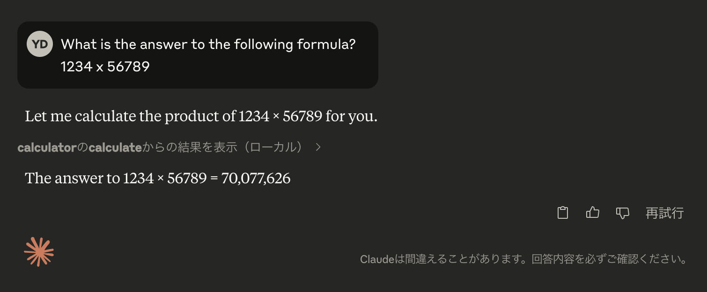

# learn-mcp-server

## step 1

Build source code from this repository.

```sh
$ go build ./
```


## step 2

In the Claude for Desktop App configuration file, include the following:

```json
{
  "mcpServers": {
    "calculator": {
      "command": "/path/to/github.com/demouth/learn-mcp-server/learn-mcp-server",
      "args": []
    }
  }
}
```

see https://modelcontextprotocol.io/quickstart/server


## step 3

Restart Claude for Desktop.


## step 4

Ask the following question in Claude for Desktop:

```
What is the answer to the following formula?
1234 x 56789
```



Logs are output to the following directory:

```
~/Library/Logs/Claude/
```
